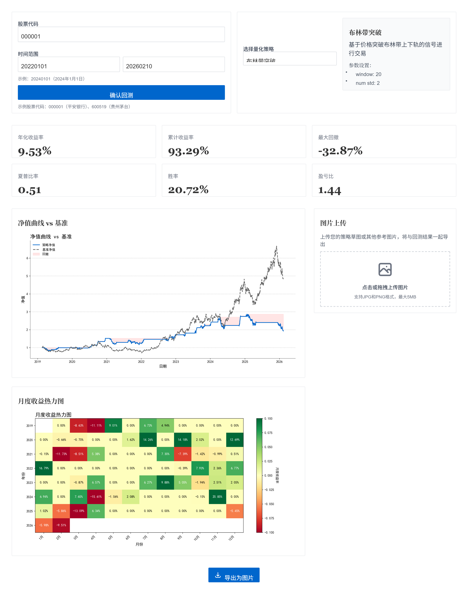

# A股量化交易回测可视化系统（WSJ风格）

基于React 18 + Tailwind CSS 3 + Vite的前端，以及Python + FastAPI的后端，构建的专业量化策略分析工具。整体视觉遵循《华尔街日报》（WSJ）经典设计风格，强调数据可读性与专业感。

## 技术栈

### 前端
- React 18
- Tailwind CSS 3
- Vite
- html2canvas
- Axios

### 后端
- Python 3.10+
- FastAPI
- Pandas / NumPy
- Matplotlib
- akshare (用于获取A股数据)

## 功能特性

- **策略选择**：支持三种预设量化策略（双均线金叉死叉、RSI超卖反转、布林带突破）
- **股票代码输入**：支持输入A股股票代码进行回测
- **日期范围选择**：支持自定义回测的开始和结束日期
- **绩效指标**：显示年化收益率、累计收益率、最大回撤、夏普比率、胜率、盈亏比等核心指标
- **图表可视化**：净值曲线（含回撤阴影）、月度收益热力图
- **图片上传**：支持上传策略草图，与回测结果并排对照
- **看板导出**：将整个回测区域导出为PNG图片
- **响应式设计**：适配桌面、平板和移动端

## 安装步骤

### 1. 克隆项目

```bash
git clone https://github.com/Eazinchen/quant.git
cd quant
```

### 2. 安装前端依赖

```bash
npm install
```

### 3. 安装后端依赖

```bash
cd backend
pip install -r requirements.txt
cd ..
```

## 启动项目

### 1. 启动后端服务器

```bash
cd backend
python main.py
```

后端服务器将在 `http://localhost:8081` 上运行。

### 2. 启动前端开发服务器

```bash
npm run dev
```

前端服务器将在 `http://localhost:3000` 上运行。

## 项目结构

```
├── backend/              # 后端代码
│   ├── main.py           # FastAPI应用入口
│   ├── strategies.py     # 量化策略实现
│   ├── backtest.py       # 回测引擎
│   ├── data.py           # 数据获取与处理
│   ├── charts.py         # 图表生成
│   └── requirements.txt  # 后端依赖
├── src/                  # 前端代码
│   ├── components/       # 前端组件
│   │   ├── StrategySelector/  # 策略选择组件
│   │   ├── MetricCards/       # 绩效指标卡片
│   │   ├── ChartPanel/        # 图表面板
│   │   ├── ImageUploader/     # 图片上传组件
│   │   └── ExportButton/      # 导出按钮组件
│   ├── services/         # API服务
│   │   └── api.js        # Axios请求封装
│   ├── styles/           # 样式文件
│   │   └── index.css     # Tailwind CSS配置
│   ├── App.jsx           # 主应用组件
│   └── main.jsx          # React入口
├── index.html            # HTML模板
├── package.json          # 前端依赖
├── tailwind.config.js    # Tailwind配置
├── vite.config.js        # Vite配置
└── README.md             # 项目说明
```

## API接口

### 获取策略列表

- **URL**: `/api/strategies`
- **方法**: GET
- **返回**: 策略列表，包含策略ID、名称、描述和参数

### 运行回测

- **URL**: `/api/backtest`
- **方法**: POST
- **参数**:
  - `strategy_id` (策略ID)
  - `stock_code` (股票代码，默认为"000001")
  - `start_date` (开始日期，格式为"YYYYMMDD")
  - `end_date` (结束日期，格式为"YYYYMMDD")
- **返回**: 回测结果，包含绩效指标和Base64编码的图表

### 回测结果示例



## 注意事项

1. 后端使用akshare获取A股数据，需要网络连接。
2. 对于某些股票或时间周期，策略可能不会生成交易信号，导致回测结果显示为零。
3. 回测结果仅供参考，不构成投资建议。
4. 图表生成可能需要一定时间，特别是在处理大量数据时。
5. 系统已修复中文显示问题，图表中的中文文本会正确显示。
